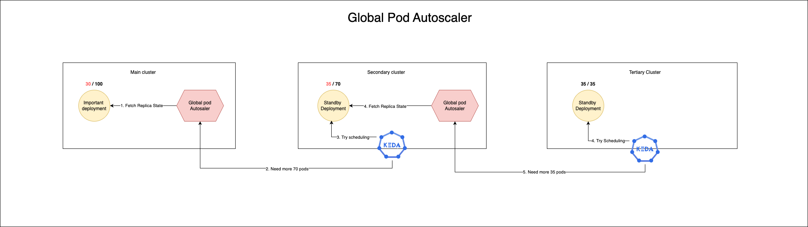

# GlobalPodAutoscaler (GPA)

GlobalPodAutoscaler (GPA) is a Kubernetes extension designed to provide high availability for your deployments by enabling automatic scaling of pods across multiple clusters. GPA actively scales deployments on a primary cluster while maintaining a backup cluster to ensure uninterrupted service in the event of resource outages on the primary cluster.

## Features

- Automatically scale pods across multiple clusters.
- Active scaling on the primary cluster with a secondary cluster as a backup.
- Seamless failover to secondary cluster in case of resource outages on the primary cluster.
- Automatic recovery of deployments from the secondary cluster back to the primary cluster once resources become available.

## Architecture



Global pod autoscaler is deployed in primary cluster and watches the state of the deployment. The state of the deployment is reported back to KEDA every 5 second. Here is the KEDA scaler to talk to global pod autoscaler.

```yaml
#examples/external-scalar.yaml
apiVersion: keda.sh/v1alpha1
kind: ScaledObject
metadata:
  name: scaler-name
spec:
  scaleTargetRef:
    name: secondary-deployment-name
  minReplicaCount: 1
  maxReplicaCount: 20
  pollingInterval: 1
  triggers:
    - type: external-push
      metadata:
        scalerAddress: global-pod-autoscaler-service-link
        governer: main-cluster-deployment-to-watch
        namespace: main-cluster-deployment-namespace
```

KEDA is reported back the number of pods required every 5 second and KEDA provisions the necessary HPA to scale the secondary deployment.

In theory then you can set up multiple cluster and create a chain of deployments to make sure you are always up and running.

## Installation

Create the necessary RBAC required to run GlobalPodAutoscaler

```
kubectl apply -f ./examples/rbac.yaml
```

Deploy the global pod autoscaler

```
kubectl apply -f ./examples/global-pod-autoscaler.yaml
```

## Contributing

We welcome contributions to the GlobalPodAutoscaler project. Please feel free to submit issues, fork the repository, and send pull requests.

Read more about KEDA Extenal Scaler [here](https://keda.sh/docs/2.10/concepts/external-scalers/).

## License

This project is licensed under the [MIT License](LICENSE).
